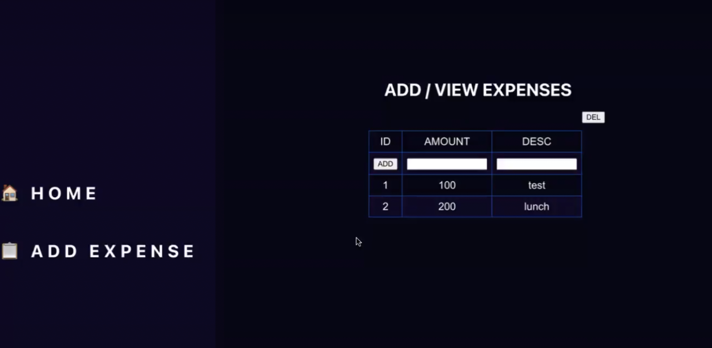
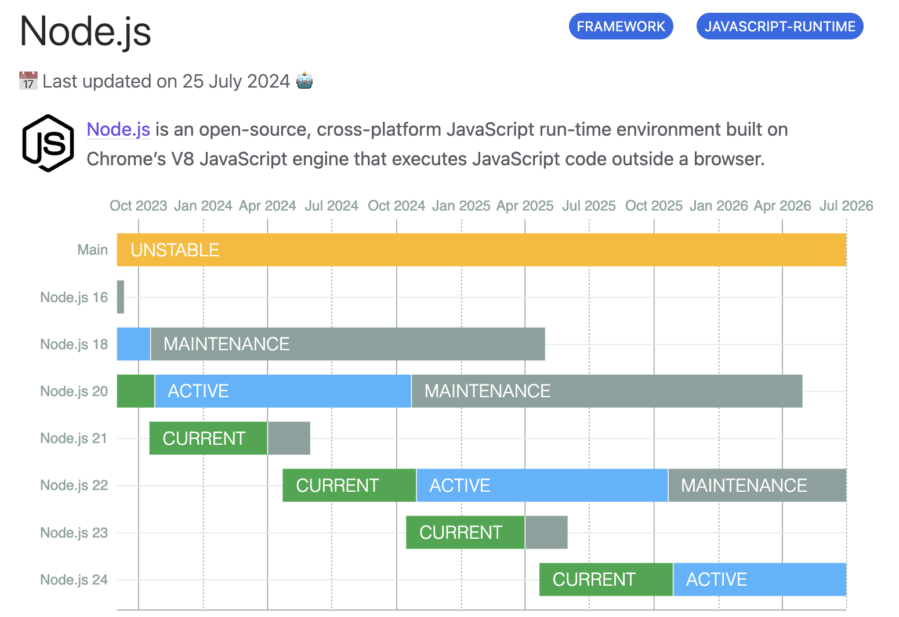

### Backend

Backend represents the actual application and is developed by using NodeJS.

!!! Technology to be used is dependent on the feature of the application and the skill set that the company has and it's purely developer driven. Cloud & DevOps Team have no control on it.

Always ensure you check with the developers on the version to be installed.

```
    Developer has defined that NodeJS >18 works for this application.  And we would be going with node 20 version

    !!! Nodejs code varies from version to version, so it's essential to know the version to be installed for 100% functionality of the application
```

On RHEL9, dnf by default installs nodejs:16 which is not desired in our case. You can check the same by running `dnf install nodejs` and this shows the downloaded version would be 16.

So, ensure you disable the default node repo and enable the needed repo.


```
    # dnf module list 
    # dnf module disable nodejs -y
    # dnf module enable nodejs:20 -y 
```

Now install Nodejs and you can see you that the downloaded version would be 20

```
    # dnf install nodejs -y
```


### What's next ? Configure the application !

!!! Keep in mind applications are not supposed to be running by a human-user, so always create a user and define path for this applicaiton. So that applications will even after someone leaves.

```
    # useradd expense
```

### We keep application in one standard location. This is a usual practice that runs in the organization.

```
    # mkdir /app 
```


#### Download the application code to created app directory.

```
    # curl -o /tmp/backend.zip https://expense-web-app.s3.amazonaws.com/backend.zip 
    # cd /app 
    # unzip /tmp/backend.zip
```

#### Every application is developed by development team will have some common softwares that they use as libraries. This application also have the same way of defined dependencies in the application configuration.

```
    # cd /app 
    # npm install       [ This will download and install all the packages needed for the application from package.json in a binary format under node_modules ]
```

#### As this is a service configured by us, you won't be seeing `systemctl start serviceName`.

Let's configure a service with name `backend` to start & stop the service.

Setup SystemD Expense Backend Service using the below content :  ( ensure you give the mysql-server private ip address and that's how your backend knows where it has to save and retrive the data from. Failing to give the mysql ip will result in failure of saving data in app )

    # vim /etc/systemd/system/backend.service

```
[Unit]
Description = Backend Service

[Service]
User=expense
Environment=DB_HOST="<MYSQL-SERVER-IPADDRESS>"
ExecStart=/bin/node /app/index.js
SyslogIdentifier=backend

[Install]
WantedBy=multi-user.target
```
#### Change the permissions and ownership of the /app directory to expense user

```
    # chmod -R 775 /app
    # chown -R expense:expense /app
```


Load the service.

```
    # systemctl daemon-reload
```

Start the service.
```
    # systemctl enable backend 
    # systemctl start backend
```

For this application to work fully functional we need to load schema to the Database. Defining schema is like define the structure of the table with rows & columns and this will essentially be coming up from the developers.

#### We need to load the schema. To load schema we need to install mysql client.

To have it installed we can use

``` # dnf install mysql -y 
```

### Inject Schema from backend app 

```
    mysql -h <MYSQL-SERVER-IPADDRESS> -uroot -pExpenseApp@1 < /app/schema/backend.sql 
```

This completes the web application configuration and at this moment, you should be able to access the applicaiton using fronend ip address from browser and should be able to add the expenses.



Note:
1) Each and every tehc like node or java or go, will have a version that will have an active end of life and once it reaches, developer has to make the code upgrade using the standard documentation.

2) Below picture shows you nodejs end of life wrt to release



